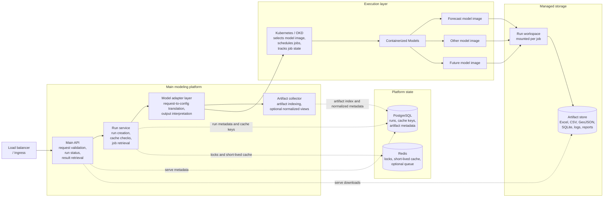

<!--
SPDX-FileCopyrightText: 2026 Fraunhofer-Gesellschaft e.V.

SPDX-License-Identifier: AGPL-3.0-or-later
-->

# Modeling Platform Architecture PRD

## Recommended Tech Stack

This proposal assumes a central platform that can run multiple independent modeling projects without forcing each modeling team to rewrite its model as an API.

- API service: FastAPI with Pydantic request and response models
- Run metadata and cache database: PostgreSQL
- Short-lived cache, locks, and optional queue support: Redis
- Model execution: Docker containers for each model, currently exploring Kubernetes Jobs as the preferred long-term execution model
- Artifact storage: object storage or persistent volumes for model outputs
- Deployment and orchestration: [Kubernetes](https://eu-2.paas.open-science-cloud.ec.europa.eu/add/all-namespaces) or OKD preferred, Docker or Dokku acceptable for early work
- Observability: logs per run at first, future options include Prometheus, Grafana, and Loki when the platform matures

## Product Summary

The platform will provide one common API for starting, tracking, caching, and retrieving results from multiple models. Each modeling project remains an independent Dockerized worker. The central platform owns the user-facing API, run records, status tracking, caching decisions, artifact indexing, and result retrieval.

The key abstraction is a model adapter. An adapter translates a platform request into the configuration required by a specific model, starts or prepares the model run, then translates the model's output folder into platform artifacts, optional normalized views, and metadata that users can retrieve later. Modeling teams need to provide a stable way to run their model and
a clear contract for the outputs they produce.

## High-Level Architecture



## Architecture Proposal

The API, workers, databases, storage, and model containers are separately
deployable components. The model adapters do not need to be separate services on day one. They can start as modules in the API or worker service and move into separate services only when a modeling team needs independent deployment, different languages, stronger isolation, or heavy dependencies.

In practice, the main API owns the model adapters, run creation, run status retrieval, cache checks, artifact indexing, and artifact/result retrieval. Kubernetes owns the execution layer: it schedules model jobs, applies resource limits, keeps model runs isolated, and reports whether a job is pending, running, completed, or failed.

The central API should not treat output folders as the source of truth. Output folders and object storage hold the raw files. The platform database stores the run metadata, status, cache key, artifact list, storage paths, checksums, and any normalized result metadata. This allows the platform to support models that output Excel, CSV, GeoJSON, NetCDF, SQLite, PDFs, images, logs, or custom folder structures.

Kubernetes is useful for repeatable deployment, load balancing, resource limits, and running each model execution as a
job that can be tracked as running, completed, or failed. It does not replace model adapters, artifact indexing, or
semantic caching. If managed Kubernetes or OKD is available, it should be preferred. If not, the same platform concept
can start with Docker-based workers and move to Kubernetes later.

## Run Lifecycle

1. A user requests a model run through the main API.
2. The API validates the request and normalizes it into a platform run definition.
3. The platform computes a cache key from the model name, model version, adapter version, input dataset version,  scenario parameters, and config version.
4. If a matching completed run already exists, the API returns the existing run and artifacts instead of starting a new model execution.
5. If no cached run exists, the platform creates a run record and starts a model container or Kubernetes Job.
6. The model writes outputs to a deterministic run workspace.
7. The platform tracks status from the container or job state and stores logs for debugging.
8. When the run completes, the adapter validates required outputs, promotes artifacts into managed storage, and indexes them in the platform database.
9. The adapter may also extract selected outputs into normalized result views for dashboards or API queries.
10. Users retrieve artifacts or normalized results through the platform API.

## Output Handling

Modeling teams are not required to produce a database. They may produce any file-based outputs that are useful for their model, including spreadsheets, geospatial files, reports, images, logs, or domain-specific formats.

The platform handles outputs in two stages:

- Artifact indexing: every completed run gets an indexed list of files, storage paths, file types, sizes, checksums, and semantic roles where known.
- Semantic extraction: adapters optionally parse selected outputs into normalized tables or API views when the platform needs filtered, comparable, or dashboard-ready results.

The platform should store all important artifacts, but it should only normalize the outputs that have clear product or scientific value. This avoids forcing every model output into a shared schema too early.

## Caching

Caching should be based on a deterministic key derived from meaningful inputs, not just the model name. A cached result is valid only when the request, model image or version, adapter version, input dataset version, config version, and scenario parameters match a previous completed run.

Successful runs can be reused for repeated requests. Failed runs should keep logs for debugging but should not satisfy cache hits. Retention rules should decide how long completed artifacts, failed logs, and intermediate files are kept.

## Requirements For Modeling Teams

Each modeling team should provide the following:

- A Docker image or Dockerfile for the model.
- One documented non-interactive command that runs the model to completion.
- A machine-readable configuration format or a template that the platform can fill in. (.toml files could be used here)
- Clear required inputs and a way to identify the input data.
- A deterministic output directory inside the container.
- Success and failure expectations, including process exit code behavior, required output files, and known failure modes.
- An output artifact contract that describes expected file names or patterns, artifact types, scientifically meaningful outputs, user-facing outputs, units, and important dimensions.
- Approximate resource expectations, including CPU, memory, runtime, storage, and whether concurrent runs are safe.

Optional:

- A `manifest.json` file describing produced artifacts.
- A sample config file.
- A sample output folder.
- A minimal smoke-test run that finishes quickly.

## Example Model Contract

```yaml
model_name: forecast-sites
image: registry.example.org/models/forecast-sites:1.0.0
run_command: python src/main.py 
config_mount_path: /app/src/simulation_options.toml
output_directory: /outputs
required_inputs:
  - basque_case_study.sqlite
required_artifacts:
  - output.sqlite
artifact_patterns:
  - "*.xlsx"
  - "*.geojson"
  - "*.sqlite"
success:
  exit_code: 0
  required_files_exist: true
resources:
  cpu: "2-4"
  memory: "8-16 GB"
  expected_runtime: "minutes to hours depending on scenario size"
```

## Success Criteria

 A successful first version can:

- Register multiple models through adapters.
- Start model runs from one API.
- Track run status reliably.
- Reuse cached completed runs when inputs match.
- Store and index artifacts independently of each model's internal output format.
- Expose downloads and selected normalized views through the platform API.
- Add new models by adding a Docker image, model contract, and adapter
