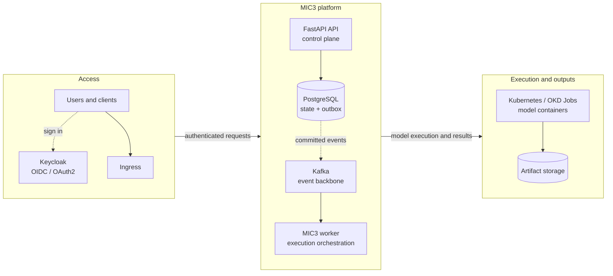
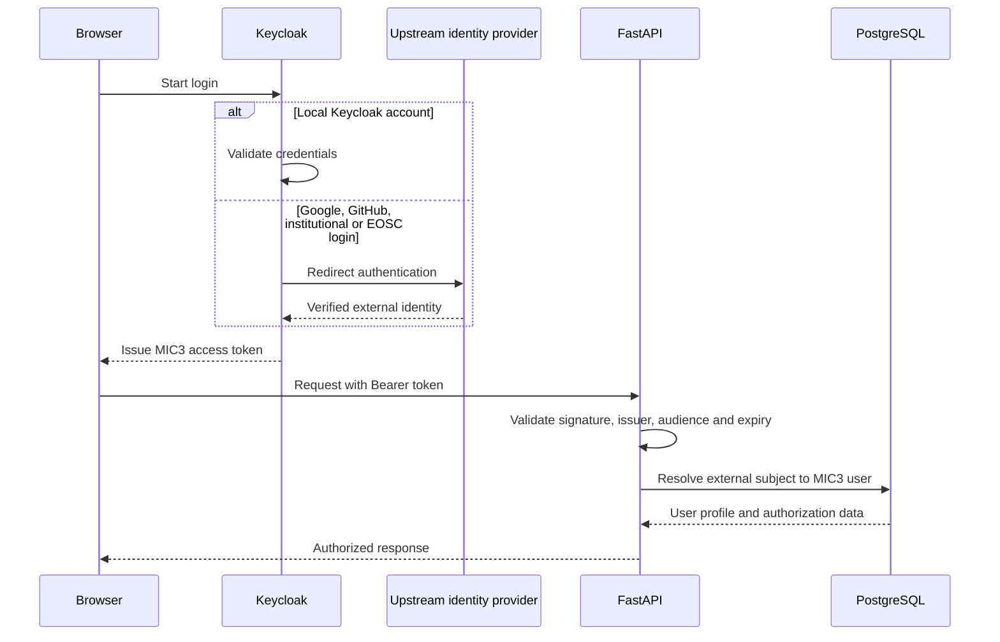
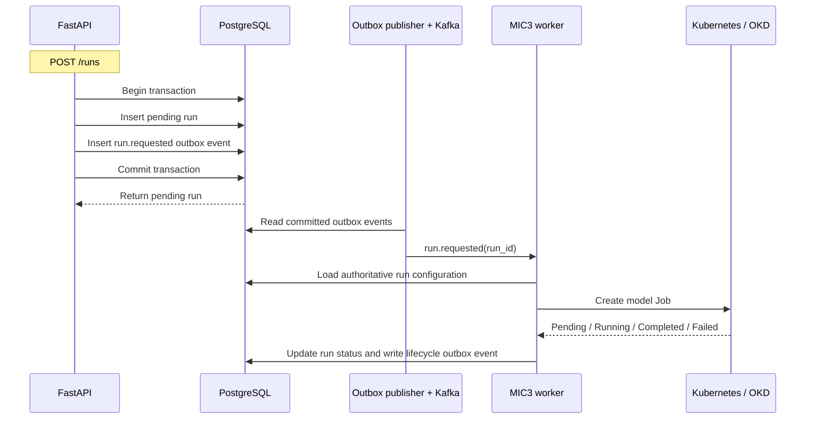
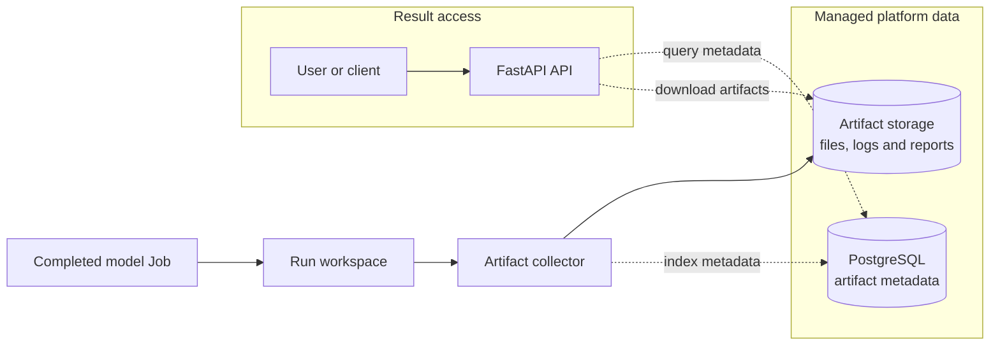

<!--
SPDX-FileCopyrightText: 2026 Fraunhofer-Gesellschaft e.V.

SPDX-License-Identifier: AGPL-3.0-or-later
-->

# mic3-api Architecture PRD

## Recommended Tech Stack

This proposal assumes a central platform that can run multiple independent modeling projects without forcing each modeling team to rewrite its model as an API.

- API service: FastAPI with Pydantic request and response models
- Persistence: PostgreSQL as the source of truth, accessed through SQLAlchemy and evolved with Alembic
- Authentication: OIDC/OAuth2 with JWT access tokens; Keycloak is the initial identity provider and identity broker
- Asynchronous messaging: Apache Kafka for durable run commands and lifecycle events, introduced after the initial platform bootstrap
- Reliability: a transactional outbox publishes committed database changes to Kafka
- Model execution: independent model containers launched as finite Kubernetes/OKD Jobs by a dedicated worker
- Artifact storage: object storage or persistent volumes for model outputs
- Deployment and orchestration: [Kubernetes](https://eu-2.paas.open-science-cloud.ec.europa.eu/add/all-namespaces) or OKD, with Docker used for local development
- Observability: logs per run at first, future options include Prometheus, Grafana, and Loki when the platform matures

Redis, RabbitMQ, and a second message broker are not part of the current architecture. Redis may be reconsidered later only for a concrete caching or locking requirement.

## Decision Summary

- The FastAPI service is the public control plane. It validates requests, performs synchronous CRUD and queries, and records durable state in PostgreSQL.
- PostgreSQL is authoritative; Kafka is a communication mechanism, not application storage.
- Run execution and other long-running work are event-driven. Authentication, ordinary reads, metadata edits, and most CRUD remain synchronous.
- The API writes a run record and an outbox event in one database transaction. An outbox publisher sends the message to Kafka, and a worker consumes it, reads the full run configuration from PostgreSQL, and creates the Kubernetes Job.
- Only the worker receives Kubernetes Job permissions. The public API must not create Jobs directly.
- Keycloak runs as an independent infrastructure service, issues a consistent MIC3 token, and can later broker Google, GitHub, institutional, or EOSC/MyAccessID identities.
- The initial delivery remains deliberately small: deploy and verify `/health`, then validate a manual Job before adding database, authentication, Kafka, and worker behavior.

## Product Summary

The platform will provide one common API for starting, tracking, caching, and retrieving results from multiple models. Each modeling project remains an independent containerized workload. The central platform owns the user-facing API, run records, status tracking, caching decisions, artifact indexing, and result retrieval.

The key abstraction is a model adapter. An adapter translates a platform request into the configuration required by a specific model, starts or prepares the model run, then translates the model's output folder into platform artifacts, optional normalized views, and metadata that users can retrieve later. Modeling teams need to provide a stable way to run their model and
a clear contract for the outputs they produce.

## High-Level Architecture

### Platform overview



### Authentication flow



### Event-driven run execution



### Artifact processing



## Architecture Proposal

The API, worker, Keycloak, Kafka, PostgreSQL, storage, and model containers are separately deployable components. They may live in one repository initially, but they must not be packaged into one container. Keycloak is an infrastructure dependency rather than a MIC3 business microservice and owns its own schema/database. It may share a PostgreSQL server initially, but not MIC3's database or database user.

The API owns HTTP validation, synchronous application operations, run creation, cache checks, and result retrieval. The worker owns execution orchestration, Kubernetes interaction, run-state updates, and asynchronous artifact processing. Kubernetes schedules model Jobs, applies resource limits, isolates executions, and reports whether a Job is pending, running, completed, or failed. The API service account must not receive Job-creation permission; the worker receives only the minimum required RBAC.

Model-specific request/configuration translation, execution orchestration, and artifact interpretation remain distinct concerns. Model adapters do not need to be services on day one and should not become a large abstraction before a real model contract stabilizes.

The central API should not treat output folders as the source of truth. Output folders and object storage hold the raw files. The platform database stores the run metadata, status, cache key, artifact list, storage paths, checksums, and any normalized result metadata. This allows the platform to support models that output Excel, CSV, GeoJSON, NetCDF, SQLite, PDFs, images, logs, or custom folder structures.

Kubernetes is useful for repeatable deployment, load balancing, resource limits, and running each model execution as a
job that can be tracked as running, completed, or failed. It does not replace model adapters, artifact indexing, or
semantic caching. If managed Kubernetes or OKD is available, it should be preferred. If not, the same platform concept
can start with Docker-based workers and move to Kubernetes later.

## Run Lifecycle

1. A user requests a model run through the main API.
2. The API validates the request and normalizes it into a platform run definition.
3. The platform computes a cache key from the model name, model version, adapter version, input dataset version,  scenario parameters, and config version.
4. If a matching completed run already exists, the API returns the existing run and artifacts instead of starting a new model execution.
5. If no cached run exists, the API creates a pending run and a `run.requested` outbox record in one PostgreSQL transaction.
6. An outbox publisher publishes a small event envelope to Kafka after the transaction commits. The event identifies the run; it does not carry the complete application state or file content.
7. A worker consumes the message, loads the authoritative run configuration from PostgreSQL, and creates a Kubernetes Job.
8. The worker updates run state in PostgreSQL as the Job becomes pending, running, completed, or failed. Consumers must be idempotent because messages can be delivered more than once.
9. The model writes outputs to a deterministic run workspace. The worker validates required outputs, promotes artifacts into managed storage, and indexes their metadata.
10. Completion/failure and later artifact-processing side effects may be published through the same outbox pattern. Users retrieve durable state and results through the API.

## Synchronous and Event-Driven Boundaries

Event-driven architecture is selective, not universal.

| Operation | Primary path |
| --- | --- |
| Login and token issuance | Browser to Keycloak; synchronous redirect flow |
| Token validation and authorization | FastAPI validates JWT; synchronous |
| Reads and ordinary CRUD/metadata edits | FastAPI to PostgreSQL; synchronous |
| Start a model execution | FastAPI to PostgreSQL/outbox to Kafka to worker |
| Run completion or failure | Worker to PostgreSQL/outbox; event-driven reactions |
| File upload | Bytes to object storage, metadata to PostgreSQL; optional event for processing |
| Artifact processing, reports, notifications | Event-driven when asynchronous work is justified |

Large files must never be sent through Kafka. Messages should contain stable identifiers such as `run_id` or `file_id`, and consumers should retrieve authoritative state from PostgreSQL or objects from storage.

## Authentication and Authorization

MIC3 is an OIDC/OAuth2 resource server and must not implement password storage, password resets, MFA, or its own `/login` endpoint. Keycloak initially supports local development users and provides the hosted login, registration, and account-management pages. It can later broker upstream Google, GitHub, institutional, or EOSC/MyAccessID providers without changing FastAPI's token contract.

FastAPI validates JWT signature, issuer, audience, and expiry using provider discovery/signing keys. Provider-specific values are supplied through configuration such as `OIDC_ISSUER_URL`, `OIDC_AUDIENCE`, and `OIDC_CLIENT_ID`. The design must remain provider-independent so a direct EOSC OIDC integration remains possible.

MIC3 keeps an application user profile keyed by the external issuer/subject identity for ownership and authorization, but stores no passwords or refresh tokens. Start with simple roles/scopes and resource ownership; do not build a general permission engine prematurely.

## Output Handling

Modeling teams are not required to produce a database. They may produce any file-based outputs that are useful for their model, including spreadsheets, geospatial files, reports, images, logs, or domain-specific formats.

The platform handles outputs in two stages:

- Artifact indexing: every completed run gets an indexed list of files, storage paths, file types, sizes, checksums, and semantic roles where known.
- Semantic extraction: adapters optionally parse selected outputs into normalized tables or API views when the platform needs filtered, comparable, or dashboard-ready results.

The platform should store all important artifacts, but it should only normalize the outputs that have clear product or scientific value. This avoids forcing every model output into a shared schema too early.

## Caching

Caching should be based on a deterministic key derived from meaningful inputs, not just the model name. A cached result is valid only when the request, model image or version, adapter version, input dataset version, config version, and scenario parameters match a previous completed run.

Successful runs can be reused for repeated requests. Failed runs should keep logs for debugging but should not satisfy cache hits. Retention rules should decide how long completed artifacts, failed logs, and intermediate files are kept.

## Requirements For Modeling Teams

Each modeling team should provide the following:

- A Docker image or Dockerfile for the model.
- One documented non-interactive command that runs the model to completion.
- A machine-readable configuration format or a template that the platform can fill in. (.toml files could be used here)
- Clear required inputs and a way to identify the input data.
- A deterministic output directory inside the container.
- Success and failure expectations, including process exit code behavior, required output files, and known failure modes.
- An output artifact contract that describes expected file names or patterns, artifact types, scientifically meaningful outputs, user-facing outputs, units, and important dimensions.
- Approximate resource expectations, including CPU, memory, runtime, storage, and whether concurrent runs are safe.

Optional:

- A `manifest.json` file describing produced artifacts.
- A sample config file.
- A sample output folder.
- A minimal smoke-test run that finishes quickly.

## Example Model Contract

```yaml
model_name: forecast-sites
image: registry.example.org/models/forecast-sites:1.0.0
run_command: python src/main.py 
config_mount_path: /app/src/simulation_options.toml
output_directory: /outputs
required_inputs:
  - basque_case_study.sqlite
required_artifacts:
  - output.sqlite
artifact_patterns:
  - "*.xlsx"
  - "*.geojson"
  - "*.sqlite"
success:
  exit_code: 0
  required_files_exist: true
resources:
  cpu: "2-4"
  memory: "8-16 GB"
  expected_runtime: "minutes to hours depending on scenario size"
```

## Success Criteria

 A successful first version can:

- Register multiple models through adapters.
- Start model runs from one API.
- Track run status reliably.
- Reuse cached completed runs when inputs match.
- Store and index artifacts independently of each model's internal output format.
- Expose downloads and selected normalized views through the platform API.
- Add new models by adding a Docker image, model contract, and adapter.

## Delivery Sequence

1. Deploy the minimal FastAPI service and verify `/health`, `/docs`, and `/openapi.json` on EOSC/OKD.
2. Validate a trivial Kubernetes Job manually, including scheduling, logs, status, and resource limits.
3. Add PostgreSQL, SQLAlchemy, Alembic, an initial user profile, OIDC token validation, `/users/me`, and local Keycloak.
4. Add the Kafka contract, transactional outbox, publisher, and separately deployed worker.
5. Prove the complete path with a trivial run: API transaction to Kafka to worker-owned Kubernetes Job to persisted final status.
6. Add real model contracts, adapters, caching, and artifact processing only after the platform path is validated.
