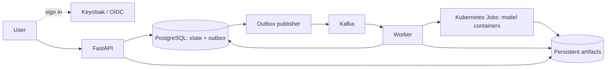
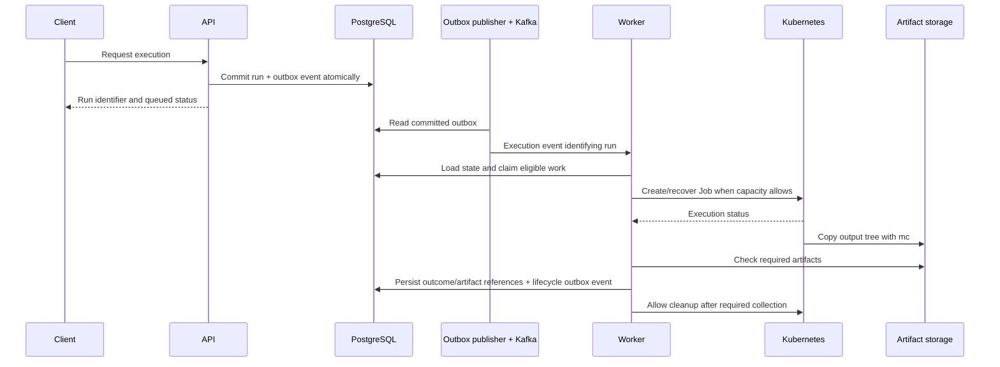

<!--
SPDX-FileCopyrightText: 2026 Fraunhofer-Gesellschaft e.V.

SPDX-License-Identifier: AGPL-3.0-or-later
-->

# MIC3 platform architecture

MIC3 will provide a common API to request, track, reuse, and retrieve results
from independent scientific models. This document records intended architecture;
[local project status](../../PROJECT_STATUS.md) (Git-ignored) owns implementation order and evidence.
Integrated execution, Kafka, model integrations, and result reuse are not yet implemented.
Artifacts use Helm-managed AIStor and MinIO Client copy; broader operational
qualification remains open. See local project status for evidence and next steps.

## Components and boundaries

```mermaid
flowchart LR
    user[User] -. sign in .-> idp[Keycloak / OIDC]
    user --> api[FastAPI]
    api --> db[(PostgreSQL: state + outbox)]
    db --> publisher[Outbox publisher]
    publisher --> kafka[Kafka]
    kafka --> worker[Worker]
    worker --> db
    worker --> jobs[Kubernetes Jobs: model containers]
    jobs --> storage[(Persistent artifacts)]
    worker --> storage
    api --> storage
```

- **FastAPI** owns synchronous authentication/authorization, CRUD, run admission,
  result lookup, and retrieval. SQLAlchemy manages persistence; Alembic alone
  owns schema evolution. The API must not receive model Job permissions.
- **PostgreSQL** is authoritative for users, run identity/state, ownership,
  fingerprints, artifact references, and outbox records. Kafka transports events;
  it does not replace application storage or cache scientific results.
- **Kafka** is required by the event-driven architecture. A publisher delivers
  committed outbox events; consumers use stable identifiers to load authoritative
  state. Events must not carry user tokens, large datasets, or output files.
- **The worker** owns model execution orchestration, Kubernetes interaction,
  lifecycle recovery, and output collection. It receives minimal Job RBAC and
  separate database permissions. Workers do not create or migrate schemas.
- **Scientific models** run in independent containers with their own language and
  dependencies. API, worker, model images, and infrastructure remain separately
  deployable even if maintained in one repository.
- **Persistent artifact storage** uses self-hosted AIStor; no managed S3 service
  was confirmed for this EOSC allocation. Only AIStor mounts its persistent PVC.
  Model Jobs write to temporary `emptyDir`; a MinIO Client container copies the
  output tree to isolated run/attempt prefixes. PostgreSQL records artifact
  references; authorized API downloads use object storage, not a shared mount.
  Pod loss before copy can lose outputs; failed copies can leave partial objects.
  Retention, backups, and admission limits remain explicit concerns. Logs are not
  uploaded by this flow; their retention depends on Pods or cluster logging.

## Model integration contract

Use one **model integration** per model. It validates requests and prepares
execution configuration. Start with a model identifier and model-owned parameters
(`eu-mfa`, `mode: buildings`); each integration validates its supported fields.
Scientific result interpretation remains a separate, deferred capability. An **execution backend** launches and observes
Jobs. Reserve **data adapter** for future transformations between models, including
units, dimensions, and formats, with source provenance and transformation versions.
Keep these responsibilities distinct from messaging, storage, and result reuse.
Use focused protocols and data structures; no shared scientific base class or
separate integration service is required.

Each integration explicitly maps supported modes to commands, configuration,
and expected output paths. Expose that supported-mode and parameter metadata
through the API for frontend choices, using the same definitions for backend
validation. Do not duplicate the supported-mode list in the frontend or accept
arbitrary executable commands from requests. EU-MFA initially exposes buildings
only; additional submodules require qualification before being advertised.

Initially the execution configuration contains the pinned image, command, working
directory, output mount, and resource settings, resolved from trusted integration
configuration. Treat outputs as files at known storage locations; do not require
a shared scientific result class, universal input schema, or plugin framework.
Add input bindings and result interpretation when concrete model requirements exist.

EU-MFA is the first integration target. Its YAML, CSV, Python/flodym types, and
submodel selection remain inside its integration. Supporting buildings first
does not introduce a buildings-specific public endpoint or require one integration
per submodel. Define abstractions from verified behavior, then test their
independence from EU-MFA; do not prebuild a plugin framework.

Model onboarding must establish a pinned source/image, reproducible dependencies,
one batch invocation, accepted inputs/configuration, expected outputs and failure
behavior, resource measurements, and a repeatable baseline. Scientific acceptance
belongs with the model owners; a zero exit code alone is insufficient.

## Execution and recovery

The sequence below applies after authorization, validation, and reuse/admission
checks determine that a new execution is required. Public request/response
schemas will be defined in their implementation milestone. Save parameters and
resolved execution configuration with the run; atomically insert an outbox event
containing its ID. The publisher sends that event to Kafka; the worker loads the
saved configuration and creates the Job. Kafka does not read PostgreSQL itself.

```mermaid
sequenceDiagram
    participant Client
    participant API
    participant DB as PostgreSQL
    participant Events as Outbox publisher + Kafka
    participant Worker
    participant Jobs as Kubernetes
    participant Storage as Artifact storage
    Client->>API: Request execution
    API->>DB: Commit run + outbox event atomically
    API-->>Client: Run identifier and queued status
    Events->>DB: Read committed outbox
    Events->>Worker: Execution event identifying run
    Worker->>DB: Load state and claim eligible work
    Worker->>Jobs: Create/recover Job when capacity allows
    Jobs-->>Worker: Execution status
    Jobs->>Storage: Copy output tree with mc
    Worker->>Storage: Check required artifacts
    Worker->>DB: Persist outcome/artifact references + lifecycle outbox event
    Worker->>Jobs: Allow cleanup after required collection
```

Publication and consumption may repeat. Dispatch must remain idempotent across
worker crashes and repeated events, including a crash between Job creation and
recording its identity. Recovery must find existing execution rather than start
another. Persist failures too; distinguish successful computation from successful
output collection. Do not report reusable success until required artifacts exist.

Bound admitted work and concurrent executions globally and per user. Queued runs
remain durable platform work; do not create a Kubernetes Job for every waiting
request. Apply configurable CPU, memory, temporary-storage, runtime, and retry
bounds. Cluster quotas are a final guard, not the admission policy.

Completed Job/Pod objects are temporary diagnostics, not run history. Preserve
outcomes and required artifact references before automated cleanup. Durable log
collection is separate work, not provided by the current copy flow.
Choose cleanup/retention periods against throughput and object/storage quotas;
retaining every completed Job for a day is not a universal default. Failed runs
may retain diagnostics longer, within explicit limits.

## Shared result reuse and optional Redis

Persisting a result makes it retrievable; reuse avoids another equivalent model
execution. Implement reuse once in the platform, with integrations supplying validated,
normalized model inputs. Fingerprints include model image/version, integration version,
input snapshots/content identities, effective configuration, and relevant seeds.
Changing external data or stochastic behavior must not silently reuse stale results.

- Return an equivalent successful result only when its artifacts remain available
  and the requester is authorized to access it.
- Reference equivalent queued/running work where permitted. Enforce duplicate
  prevention atomically in PostgreSQL, including concurrent submissions.
- Failed runs and expired/missing outputs cannot satisfy a successful-result lookup.
  Artifact retention and fingerprint invalidation are explicit lifecycle behavior.
- Keep result lookup behind a focused application boundary, separate from routes
  and integrations. Initially use indexed PostgreSQL lookups and persistent artifacts.

Redis may later cache fingerprint-to-run lookups, summaries/parsed views, or serve
distributed rate limiting when justified. It does not replace Kafka, PostgreSQL,
or output storage. Disposable result-cache misses fall back to durable data;
authorization and execution correctness must not depend on cache availability.
Adding Redis still requires invalidation, expiry, memory/failure policies, and
tests. Do not introduce an unused generic cache framework now.

## Identity and security

Keycloak owns credentials and its separate database; MIC3 depends on OIDC
standards, not Keycloak-specific APIs or tables. The API validates JWT signature,
issuer, audience, and expiry using externally configured discovery/signing keys.
Internal UUID users map unique `(issuer, subject)` identities; email is mutable
profile data. JIT provisioning grants only `member`. Bootstrap administrators
through controlled commands/configuration and enforce local roles/ownership.

MIC3 stores no passwords or access/refresh tokens. Missing/invalid identity yields
`401`, insufficient permission `403`. Keep `/health` public and dependency-free;
`/ready` represents PostgreSQL readiness. Other identity providers can be brokered
later without changing the API's identity boundary. Use environment configuration
and Secrets, never embedded hosts, credentials, or private keys.
